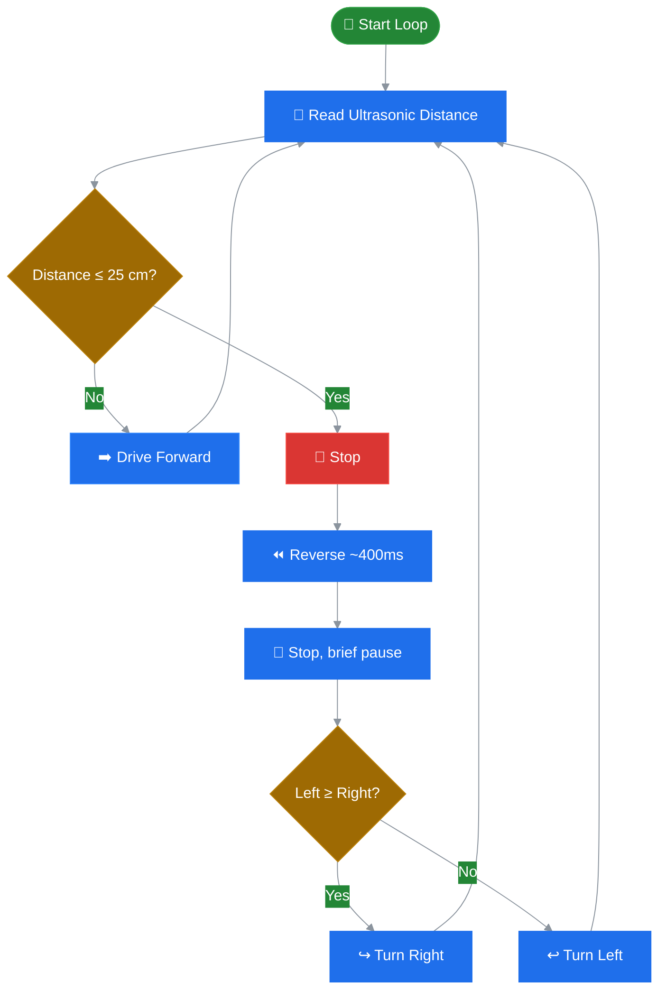

<div align="center">

# 🤖 Arduino Obstacle-Avoiding Robot

**An autonomous 2WD robot that senses and steers around obstacles in real time**


[Overview](#-overview--features) •
[Hardware](#-hardware-components--bill-of-materials-bom) •
[Wiring](#-hardware-connections--pinout) •
[How It Works](#-control-logic--decision-flow) •
[Setup](#-getting-started--uploading) •
[Troubleshooting](#-troubleshooting)

</div>

---

## 📌 Overview & Features

An Arduino-driven robot that drives forward until it senses an obstacle, then autonomously reverses and pivots to find a clear path — no remote control, no pre-mapped route.

| | |
|---|---|
| 🔊 **Ultrasonic Sensing** | Continuously measures forward distance via `NewPing`, reacting the instant it drops below a set threshold |
| 🔄 **Evasive Maneuvering** | Stops → reverses briefly → pivots toward the clearer side → resumes driving |
| 🎯 **Servo Mount Ready** | A scanning servo head is wired in for future left/right sweeps (see [Notes](#-notes--possible-improvements)) |
| ⚡ **Simple Digital Drive** | Motors run on plain HIGH/LOW signals through the L298N — no PWM speed ramping required |

---

## 📂 Repository Layout

```
obstacle-avoiding-robot/
├── firmware/
│   └── obstacle_avoiding_robot.ino   # Core Arduino sketch & motor control logic
├── docs/
│   └── Mini_Project_Report_EC681.pdf # Full academic mini-project report
└── README.md                          # Documentation & hardware wiring guide
```

---

## 📄 Project Report

📘 A full write-up covering the design, block diagram, working principle, applications, and results is available in **[`docs/Mini_Project_Report_EC681.pdf`](docs/Mini_Project_Report_EC681.pdf)**.

> Submitted as a 6th-semester mini-project (**EC-681**) for B.Tech in Electronics and Communication Engineering.

---

## 🛒 Hardware Components & Bill of Materials (BOM)

| Component | Qty | Description / Model |
|---|:---:|---|
| 🧠 Microcontroller | 1 | Arduino Uno / Nano / compatible |
| ⚙️ Motor Driver | 1 | L298N Dual H-Bridge Driver |
| 🔩 DC Motors | 2 | Gear motors with wheels |
| 📡 Ultrasonic Sensor | 1 | HC-SR04 (or compatible), via `NewPing` library |
| 🎯 Servo Motor | 1 | Mounted for future scanning use |
| 🚗 Robot Chassis | 1 | 2WD chassis with caster wheel |
| 🔋 Power Source | 1 | Battery pack sized to your motors |
| 🧵 Misc | – | Jumper wires, switch |

---

## 🔌 Hardware Connections & Pinout

### 1. Ultrasonic Sensor

| Sensor Pin | Arduino Pin | Description |
|:---:|:---:|---|
| `Trigger` | `A1` | Sends the ping pulse |
| `Echo` | `A2` | Reads the return pulse |

### 2. Motor Driver (L298N)

| Motor Driver Label | Arduino Pin | Function |
|:---:|:---:|---|
| Left Motor Forward | `7` | Drives left motor forward |
| Left Motor Backward | `6` | Drives left motor backward |
| Right Motor Forward | `4` | Drives right motor forward |
| Right Motor Backward | `5` | Drives right motor backward |

> ⚠️ **Note**: This sketch drives motors digitally (HIGH/LOW), not through the L298N's PWM enable pins — there's no speed ramping, only on/off.

---

## 🧠 Control Logic & Decision Flow



---

## ⚙️ Calibration & Tuning

Adjust these constants in `firmware/obstacle_avoiding_robot.ino` to suit your chassis:

```cpp
// Obstacle trigger distance (cm)
int distance = 100;
if (distance <= 25) { ... }   // lower = robot gets closer before reacting

// Ultrasonic max range
#define maximum_distance 200

// Turn duration (ms) — affects how sharp the pivot is
delay(900);   // inside turnRight() / turnLeft()
```

| Parameter | Effect | Tip |
|---|---|---|
| `25` (cm threshold) | How close the robot gets before reacting | Lower it if the robot turns too early; raise it if it's grazing obstacles |
| `900` (ms turn delay) | How sharp the pivot is | Increase for a wider turn, decrease for a tighter one |

---

## 🚀 Getting Started & Uploading

1. **Hardware Setup**
   - Assemble the 2WD chassis.
   - Wire the L298N, ultrasonic sensor, and servo per the [Hardware Connections](#-hardware-connections--pinout) section.
2. **Software Setup**
   - Install the [Arduino IDE](https://www.arduino.cc/en/software).
   - Install the `NewPing` library via Library Manager.
   - Open `firmware/obstacle_avoiding_robot.ino`.
3. **Flash Firmware**
   - Connect the Arduino via USB.
   - Select your board and port under **Tools**.
   - Click **Upload** (`Ctrl+U` / `Cmd+U`).
4. **Operation**
   - Disconnect USB, place the robot on an open surface, and power it from the battery.

---

## ❓ Troubleshooting

| Issue | Cause | Solution |
|---|---|---|
| 🔙 Robot drives backward | Inverted motor wiring | Swap the forward/backward pin leads for the affected motor |
| 🔁 Robot spins in place | One motor miswired or stalled | Recheck motor pin connections; test each motor individually |
| 📵 Sensor not detecting obstacles | Wiring or threshold mismatch | Open Serial Monitor, print `sonar.ping_cm()` output, and re-tune the `25` threshold |

---

## 📝 Notes / Possible Improvements

- [ ] `lookLeft()` and `lookRight()` (servo scan functions) exist in the code but aren't called in `loop()`. Wiring them in would let the robot actually scan before choosing a turn direction, instead of relying on `distanceLeft`/`distanceRight`, which currently stay at `0`.
- [ ] Motor speed is fixed (digital HIGH/LOW); switching the L298N enable pins to PWM (`analogWrite`) would allow variable speed control.

---

<div align="center">

Built by **Tushar Prasad Goswami** and team · B.Tech ECE, MAKAUT

</div>

